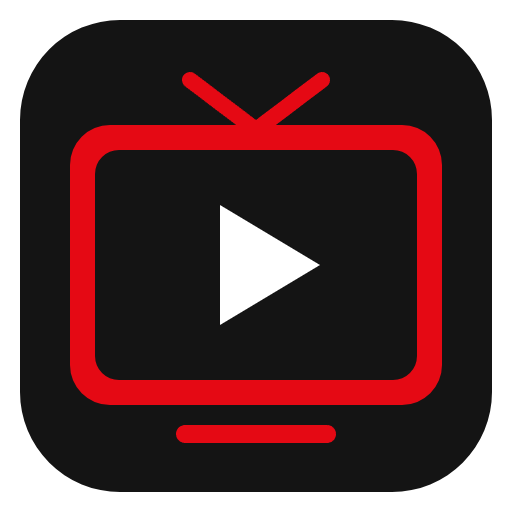

# Adás – élő TV, streaming-szolgáltatás stílusban

TV- és VOD-lejátszó Windowsra, macOS-re, Linuxra és Androidra (telefon, tablet, Android TV). Az [iptv-org](https://github.com/iptv-org/iptv)
nyilvános csatornalistáját (`https://iptv-org.github.io/iptv/index.m3u`) játssza le, streaming-szolgáltatás
stílusú felülettel, csatornaadatokkal és műsorújsággal.

## Felületstílusok

Profilonként választható a **Beállítások → Megjelenés** legördülő menüjében:

| Stílus | Jellemzői |
|---|---|
| Kurenai | Az esti mozi hangulata – fekete háttér, vörös kiemelés, rámutatásra kinagyuló kártyák. |
| Mahō | Mesés, csillagos mélykék színátmenet, fénylő keretes, lekerekített kártyák. |
| Murasaki | Sötét alap lila–rózsaszín színátmenetekkel és fénylő kiemeléssel. |
| Akane | Fekete alap, vörös jelölések, nagybetűs sorcímek – mozivászon-hangulat. |
| Shinkai | Sötét éjkék háttér, tengerkék kiemelés. |
| Garasu | Mélyfekete háttér, áttetsző, elmosott üvegfelületek, lebegő árnyékok, letisztult betűk. |
| Zen *(világos)* | Világos rizspapír-háttér, mohazöld kiemelés, sok levegő és csendes, lassú mozgások. |
| Wabi-sabi *(világos)* | Meleg, földszínű papírtextúra, kissé szabálytalan, kézműves kártyák, arany kintsugi-repedés. |
| Asobiba *(világos)* | Világos, csíkos háttér, fehér keretes buborékkártyák, ruganyos mozgás – játékbolt-hangulat. |
| Futago | Kézikonzol-menü – sötétszürke alap, piros–kék kontrollerpár, szögletes csempék türkiz kerettel. |
| Hiroba *(világos)* | A „csatornás” konzolmenü – fehér, finoman csíkos háttér, fényes, szürke keretes csempék. |
| Neon City | Éjszakai neonváros – neonsárga, cián és bíbor, levágott sarkú kártyák, pásztázó sorok, „glitch”. |
| Neo-Tokyo | Az AKIRA világa – éjszakai romváros sziluettje, Kaneda-vörös, száguldó motorfény-csíkok, fehér kapszula-jelvény, döntött tömbös címbetűk. |
| Manga *(világos)* | Fekete tus fehér papíron – rasztertónus, vastag panelkeretek, beszédbuborék-gombok, dőlt tömör címek. |
| Pow! *(világos)* | Amerikai képregény – Ben-Day pöttyök, vörös–sárga–kék, vastag fekete kontúr eltolt árnyékkal, sárga szövegdobozok, „POW!” csillagrobbanás. |
| 16-Bit *(világos)* | A 90-es évek szürke konzolja – lila gombok, színes A–B–X–Y pöttyök, pixeles keretek és képernyő-pásztázás, kockás betűk. |
| Kikagaku *(világos)* | Plakátművészet – törtfehér papír, vörös–kék–sárga–fekete, vastag keretek kemény árnyékkal. |
| Kyokkō | Lassan hullámzó színes háttér, matt üveg kártyák és lágy fénylés. |
| Rakugaki *(világos)* | Vonalas füzetlap kézírással – a csatornák beragasztott polaroid fotók, ceruzás keretek. |
| Phosphor | Régi zöld foszforos monitor – fix szélességű betűk, parancssori feliratok, inverz kijelölés. |

Ugyanitt profilonként **sorrendbe állíthatók és elrejthetők a főoldal sorai** (húzással vagy a nyilakkal,
távirányítóval is), például: Legutóbb nézett, Kedvenceid, Most a TV-ben, hazai csatornák, kategóriák, országok.



## Funkciók

**Saját médiatár / NAS (1.6)**
- Külön *Saját* részleg a saját filmeknek és sorozatoknak: a NAS (vagy bármely) mappában – almappákkal
  együtt – automatikusan keletkező .m3u / .m3u8 lejátszólistákból. Forrás lehet megosztott mappa
  (`\\NAS\Media`, `Z:\`, `/mnt/nas`; asztali változat) vagy a NAS webes címe (http könyvtárlista; tévén is).
- Minden talált lejátszólista külön, ki-be kapcsolható lista; az újakat 10 percenként magától észreveszi.
- Relatív és helyi útvonalak feloldása, kiadási fájlnevek tisztítása (cím + év), magyar információk,
  borító a Wikidatából / TMDB-ből, OpenSubtitles-feliratok és a videó melletti .srt automatikus betöltése.

**Magyar információk és feliratok (1.5)**
- Filmek, sorozatok és tévécsatornák magyar címe, leírása, műfaja, rendezője, szereplői, országa a
  Wikidatából / Wikipédiából (kulcs nélkül), vagy saját TMDB-kulccsal a TMDB-ből (értékeléssel).
- Filmekhez és sorozatokhoz magyar és angol felirat az OpenSubtitles-ről (ingyenes fiók + API-kulcs kell),
  helyi .srt / .vtt fájl (ráhúzással is), időeltolás, betűméret, automatikus keresés.

**Filmek és sorozatok (1.4)**
- Külön oldal (fejléc: *Filmek és sorozatok*) M3U / M3U8 listákból betöltött filmekkel és sorozatokkal:
  Folytatás sor, Sorozatok, csoportonkénti / műfajonkénti sorok, rácsnézet szűrővel és kereséssel.
- Film vagy sorozat? A címből ismeri fel (S01E02, 1x02, Season/Episode, „5. rész”, 第5集…; egy fájlban
  sorszámozott címek → sorozat; évszám a cím végén → film). Részletek a súgóban.
- Saját film/sorozat listák külön (Beállítások → Filmek és sorozatok – listák): cím, fájl, beillesztés,
  vagy egy teljes GitHub-tárhely. Beépített: Orphaned Films, Közkincs filmek (OnlineM3U).
- Lejátszás tekerhető idősávval, ±10 mp, folytatás onnan, ahol abbahagytad (profilonként), sorozatnál
  automatikus következő rész.

**Csatornalisták (1.3)**
- Beépített, ki-be kapcsolható listák: iptv-org, Free-TV, Pluto TV, Samsung TV Plus, Plex, FreeCast Hub,
  DragonHall TV. Több bekapcsolt lista esetén az azonos csatornák egy csatornává olvadnak (tvg-id, majd
  név + ország, majd egyértelmű név alapján); a listák adásai egymás tartalék forrásai lesznek. A listák
  saját műsorújsága is betöltődik.
- A nem elérhető csatornák kártyája szürke, OFFLINE vagy ADÁSSZÜNET jelzéssel, a név alatt felirattal.
- 11 választható rajzolt profilkép (vagy betűs avatar).

**Felület**
- TV oldal Csatornák és Felvételek füllel; vízszintesen görgethető sorok: Legutóbb nézett,
  Kedvenceid, Most a TV-ben, hazai csatornák, kategóriák, országok
- Rámutatásra kinagyuló kártyák: lejátszás, kedvenc, részletek, az éppen futó és a következő műsor
- Böngészés kategória, ország, nyelv, minőség és állapot szerint
- Keresés csatornanévre, országra, kategóriára, hálózatra **és műsorcímre** (Ctrl+F vagy `/`)

**Csatornaadatok és műsorújság**
- Adatlap minden csatornához: ország, nyelv, kategória, hálózat, tulajdonos, indulás, weboldal, időzóna, adásforrások
- Műsorújság XMLTV-forrásokból, a csatornákhoz automatikusan párosítva; napi bontás az adatlapon
- Idővonalas műsorújság-rács (Kedvencek / hazai / minden csatorna, tegnaptól +3 napig)
- Emlékeztető műsorkezdésre (rendszerértesítés + „Nézem” gomb)

**Lejátszás**
- HLS (hls.js), MPEG-TS/FLV (mpegts.js), DASH (dash.js)
- Az adások által kért `User-Agent` / `Referer` fejlécek beállítása (`#EXTVLCOPT`, `http-referrer`)
- Automatikus tartalék forrás, ha egy adás nem indul el vagy megakad
- Csatornaváltás ↑/↓ billentyűvel, csatornaszám beírása (0–9), csatornalista-panel
- Minőség-, hangsáv- és forrásválasztás, mindig felül lévő mini lejátszó, egyenként elrejthető lejátszógombok
- Elalvási időzítő (lágy elhalkulással, akár a műsor végén)
- A képernyő nem alszik el lejátszás közben; médiabillentyűk

**Megbízhatóság**
- Háttérben ellenőrzi a megjelenő csatornák adásait (zöld pötty = működik, piros = nem elérhető)
- Teljes ellenőrzés egy gombnyomásra, a hibás csatornák elrejthetők

**Kényelem**
- Kedvencek (húzással rendezhetők, ez adja a csatornaszámokat), előzmények, utolsó csatorna folytatása
- Saját M3U listák URL-ről vagy fájlból, saját XMLTV műsorújság-források
- Profilok („Ki nézi?”), gyerekprofil csak gyerek-, családi, animációs és oktatási csatornákkal
- Felnőtt tartalom alapból rejtve
- Mentés és visszaállítás fájlba (beállítások, profilok, kedvencek, emlékeztetők)
- Teljes billentyűzetes / távirányítós vezérlés (nyilak, Enter, Esc / Backspace)

**Kiadás a GitHubról, egérkurzor a távirányítón, új feliratforrás, egységes műfajok (1.25)**
- **Kiadások:** a `v*` címke pusholásakor a GitHub Actions minden platformra lefordít, és GitHub Release-be tölti a fájlokat (Windows: telepítő, hordozható, MSI · Linux: AppImage, deb · macOS: dmg, zip · Android: APK), SHA256SUMS.txt-vel; az asztali változat innen frissül (induláskor keres, kikapcsolható)
- **Kiegészítő csomagok** (`.adaspack`): nem nyilvános listák a programmal nem szállítva, beépítettként megjelenve – betöltés fájlból vagy az asztali „packs” mappából; a mentés és az átvitel is viszi. Készítés: `tools/make-pack.mjs`
- **Távirányító:** egér mód (kurzor a képernyőn, koppintás = kattintás, két ujjal görgetés), a parancsok sorban mennek (nem ugrál), a kijelölés mindig látszik; gyorsgombok: TV, Műsorújság, Böngészés, VOD
- **Feliratok.eu:** magyar és angol feliratok fiók és napi korlát nélkül, sorozatnál évadcsomagból is; a régi (Windows-1250) magyar feliratok ékezetei is helyesek
- **VOD:** egységes műfajok az AnimeAddicts műfajlistája szerint (a magyar és angol, témacsatorna-szerű csoportok ezekre fordítva), egy cím több műfajban is; alapból a 12 legnépszerűbb műfaj kap sort
- **Hálózatfigyelő:** a letöltés sebessége, a forrás válaszideje és a valós idejűség mérése; ismételt akadásnál másik forrás, kisebb minőség vagy nagyobb tartalék; megszakadt internetnél magától folytatja
- **Menü:** Főoldal · TV · VOD · Kedvencek; a TV alatt fülek: Csatornák, Műsorújság, Böngészés, Felvételek
- **Keresés:** fekvő, széles képernyőn a tévé- és a VOD-találatok két hasábban egymás mellett; Androidon egymás alatt, elöl a csatornákkal
- **Beállítások:** 15 kisebb csoport, mindegyik egy-két mondatos leírással; Androidon csak csempék
- **Lejátszó:** a kiegészítő gombok egyenként elrejthetők; a kép a képben mód megszűnt
- **Erőforrások:** a sorok fokozatosan töltődnek (fele annyi elem és kép induláskor), a Főoldal élő előnézete egy perc után megáll, kis puffer a többképes nézetben és az előnézetben
- Electron 44 (biztonsági javítások)

**Felvételek a TV alatt, ajánlósáv nélkül (1.24.1)**
- A **Felvételek** a TV oldal fülére költözött (TV → Csatornák / Felvételek); a VOD-ban csak az Online listák és a Saját médiatár maradt
- A TV és a VOD oldal tetejéről kikerült a nagy kiemelt (ajánló) sáv: az oldal rögtön a sorokkal kezdődik

**Felvétel vágása, megbízható felvétel, új távirányító QR-kóddal, levegős Beállítások (1.24)**
- **Felvétel vágása** (TV → Felvételek → ✂): előnézet, idővonal a műsorújság szerinti kezdet / vég jelével, léptetés, „Kezdet ide” / „Vége ide” (I / O), beírható időpontok; vágás újrakódolás nélkül. A vágott változatot játssza le az Adás, az eredeti megmarad (újravágható, visszaállítható, külön nem jelenik meg)
- **Ütemezett felvétel:** beállítható ráhagyás (alapból 3 perc előtte, 10 perc utána); az indítást a főfolyamat időzítője adja (a tálcán is pontos); ha az adás megszakad, a felvétel magától folytatódik ugyanabba a fájlba (folytonos időbélyegekkel)
- **Távirányító telefonról:** QR-kóddal csatlakozik (a PIN-t is átadja); érintőpad (húzás = nyilak, koppintás = OK, hosszan = Vissza), tekerés, hangerő-csúszka, felirat / minőség / lista / teljes képernyő, csatornakereső, kedvencek és előzmények, szöveg küldése, ugrás bármelyik oldalra; a lap nem kerül gyorsítótárba
- **Beállítások:** a részek kártyákon; széles képernyőn két oszlop, füles módban bal oldali csoportlista; egységes „Beállítások → csoport → rész” hivatkozások a súgóban és a felületen
- **Legnagyobb minőség** beállítás (1080p / 720p / 480p / 360p, vagy az ablakmérethez igazodó automatikus)
- Nyilas / távirányítós kezelés: a kijelölés a tartalommal kezd, oldalsávról jobbra a tartalomra lép, fülváltás után nem vész el

**Földrajzi korlát jelzése, adás adatai, nincs befagyás, kevesebb akadás (1.23)**
- **🌐 Földrajzi korlát:** a kártyákon, az adatlapon és a lejátszó hibaüzenetében; a háttér-ellenőrzés és a lejátszás a 403 / 451 választ felismeri („innen nem nézhető”), a lista `[Geo-blocked]` címkéje „korlátozott lehet” jelzés, amely eltűnik, ha az adás innen mégis működik; szűrő a Böngészésben
- **Adás adatai** panel (⚙ → 📊, vagy `D`): lejátszómotor, kiszolgáló, felbontás, kodekek, bitráta (mért is), letöltési sebesség és annak aránya a bitrátához, puffer, késés az élőtől, eldobott képkockák, akadások, hálózat – tanáccsal, ha akadhat
- **Műsorújság frissítése / ki-be kapcsolása:** a felület nem fagy be (eddig akár 4–5 mp-re): a letöltés, kicsomagolás és fájlkezelés aszinkron, a feldolgozás és a csatornapárosítás a háttérszálon, az adatok bájtként és részletekben érkeznek, a műsorok csak használatkor jönnek létre; a frissítés kb. kétszer gyorsabb
- **Kevesebb akadás:** az élő adás 4 résznyivel a széle mögött indul (a még készülő részt sok szerver csak valós időben küldi), a kis időbélyeg-réseken a lejátszó átlép, óvatosabb minőségváltás; a háttér-ellenőrzés lejátszás közben szünetel
- Beállítások, gyorsítótár és listák mentése aszinkron (kilépéskor megvárja)
- Biztonság (1.22.1-ből): LAN-továbbító engedélylistával és kapcsolódáskori IP-ellenőrzéssel, korlátos fájlolvasás, HTML-tisztítás, Android allowBackup=false

**Felvételek az alkalmazásban, új Beállítások, minden ablakméret (1.22)**
- **VOD → Felvételek** fül (asztali): a saját tévéfelvételek csatornalogóval, dátummal, mérettel; lejátszás az Adás saját lejátszójában (tekerhetően, folytatással), külső lejátszó, törlés; a most rögzített és az ütemezett felvételek is itt
- A lejátszási híd az MPEG-TS fájlokat (.ts) is lejátssza (AAC / MP2 hang, nem nulláról induló időbélyegek)
- **Beállítások:** nyolc csoport (Megjelenés és főoldal · Lejátszás · Listák és források · Tartalom és gyerekek · Értesítések · Eszközök és szinkron · Profilok és mentés · Frissítés), **csempés** vagy **füles** elrendezés választható, kereső az összes beállítás között; új Névjegy (verzió, platform, adatok helye, adatforrások)
- A felugró ablakok minden képernyőméretben elférnek (a tartalmuk belül görget); telefonos javítások: listák gombjai, választómezők, sorok nyilai, statisztika, keresés

**Sportfigyelő, VOD cím- és borítószerkesztő (1.21)**
- **Sportfigyelő** ablak (a főoldal Sport egységéből vagy Beállítások → Főoldal): bármilyen sportág, bajnokság, csapat vagy verseny követése
  - **Bajnokságok:** 357 bajnokság / torna 17 sportágban az ESPN nyilvános adataiból (kulcs nélkül, élő állással, eredménnyel); csapat szerinti követés
  - **Sportágak a tévében:** kb. 40 sportág és játék (kézilabda, vízilabda, disc golf, World Chase Tag, sakk, darts, e-sport…) és saját kulcsszó (pl. Fradi) a műsorújság alapján
  - **Naptár:** bármilyen .ics / webcal versenynaptár; nem kötelező TheSportsDB-kulcs további bajnokságokhoz
  - **Csatornaajánlás:** minden eseménynél 📺 gomb arra a csatornára, ahol a műsorújság szerint látható
- VOD: az „Előzetes” gomb megszűnt; a cím és a borító egy ablakban szerkeszthető, a borítóképek között **saját keresőszóval** is kereshetsz (AniList, Kitsu, MyAnimeList, TVmaze, magyar és angol Wikipédia, Wikidata; saját kulccsal TMDB és OMDb / IMDb)

**Saját listák javítása, AKIRA-, manga- és képregény-téma (1.20.1)**
- ANSI (Windows-1250) kódolású listák ékezetei helyesek (UTF-8 / UTF-16 / ANSI felismerés a fájlokban és a letöltött listákban)
- Saját médiatár: egy vegyes filmlistában egyetlen sorozatrész miatt a többi film nem kerül a sorozat extrái közé (eddig emiatt tűnhettek el tételek); értelmetlen #EXTINF-cím (pl. „No1”) helyett a fájlnév, ékezetes változat előnyben; feliratok / szövegfájlok nem jelennek meg filmként
- Neo-Tokyo átdolgozva AKIRA-stílusúra; új stílus: **Manga** és **Pow!** (amerikai képregény)

**Új stílusnevek, saját témák, magyar VOD-címek, kép a képben Androidon (1.20)**
- A stílusok új, márkanév nélküli nevei: Kurenai, Mahō, Murasaki, Akane, Shinkai, Garasu, Zen, Wabi-sabi, Asobiba, Futago, Hiroba, Neon City, Kikagaku, Kyokkō, Rakugaki, Phosphor; új stílus: **Neo-Tokyo** (80-as évekbeli anime-romváros) és **16-Bit** (90-es évekbeli szürke konzol)
- A főoldal egységei (csempék) minden stílusban a stílushoz illő kinézetet kapnak
- Saját témák: téma-fájl (`.adastheme` / `.json`) feltöltése, vagy asztali gépen téma-mappa; az elrendezést módosító CSS-t az alkalmazás kiszűri. Teljes leírás és minta: [docs/TEMA-KESZITES.md](docs/TEMA-KESZITES.md)
- Új, hozzáadható főoldali egységek: Megnézendő, Új részek, Hamarosan kezdődik, Ma esti filmek, Nézési idő, Fedezd fel, Nap és levegő, Jegyzet
- VOD: magyar cím a kártyákon és az adatlapon (alatta az eredeti), kézi cím; borítókép-választó több forrásból, saját képcímmel vagy képfájllal
- Lista-feldolgozás: „Cím - 01 [CRC]” és „Part 2 - 01” részek, évadmappák („Season 2/…”), általános fájlnevek (index.m3u8), azonos című, eltérő hosszú filmek helyes kezelése (eddig ezek összevonódhattak)
- Android: kép a képben (lebegő kis ablak, kilépéskor magától is), háttérlejátszás értesítéssel (beállítható)

**Egységes elrendezés minden stílusban (1.19.1)**
- Minden felületstílus ugyanazzal az elrendezéssel: felső menüsáv (az oldalsó menüsáv megszűnt), hat csatornás lapozó kiemelt sáv, azonos kártyaméretek, térközök és magasságok; a stílus csak a kinézetet adja (színek, betűk, keretek, árnyékok, minták, animációk)
- Rögzített sormagasság, így a stílus betűtípusa sem tolja el az elemeket

**Szinkron kóddal, távirányító, felvétel és sok új funkció (1.19)**
- Szinkronizálás eszközök között (asztali ↔ Android TV ↔ Android telefon, bármelyik irányba): az egyik eszköz 6 jegyű kódot ad, a másikon csak a kódot kell beírni – magától megtalálja a helyi hálózaton (Android: új LanServer)
- Távirányító telefonról: böngészős vezérlőlap PIN-nel (csatorna, hangerő, nyilak, OK / Vissza, számok, kedvencek)
- Felvétel (asztali): azonnal a lejátszóból vagy ütemezve a műsor-adatlapról, újrakódolás nélkül (.ts)
- Gyerekprofilok: „Nézheti” kapcsoló gyerekprofilonként külön; napi nézési idő és korhatár (a műsorújság korhatár-adatai alapján), szülői PIN-nel feloldható
- Főoldal: új egységek (óra + névnap, árfolyamok, sporteredmények, ajánlott neked), kész elrendezések, napszak szerinti váltás, élő előnézet az utoljára nézett csatornán
- Műsorújság: kategória-szűrő, „Most műsoron” nézet, naptárba mentés (.ics)
- VOD: Megnézendő lista, évadonkénti haladás és „évad megnézve”, előzetes (YouTube)
- Lejátszás: előző csatorna (R), csatornánkénti hangerő, feliratszín / -háttér, gyorsabb tartalékforrás-váltás akadásnál
- Statisztika: heti összesítő, nem működő kedvenc csatornák (heti értesítéssel); napi automatikus mentési pont, visszaállítással
- Javítva: átvétel / visszaállítás után a régi állapot visszaíródhatott (a bezáráskori mentés felülírta)

**Testreszabható főoldal (1.18)**
- A főoldal egységei (időjárás, most a tévében, hírek, ma este, utoljára nézett csatorna, VOD-folytatás, kedvenc csatornák, emlékeztetők) átrendezhetők (gombokkal vagy áthúzással), átméretezhetők, elrejthetők; a rács oszlopai (1–5) és sorai (1–4) állíthatók – profilonként, és mindig egy képernyőre fér
- Minden egység a saját méretéhez igazítja, mit és mennyit mutat (hírek / műsorok száma, kép, bevezető, napok, órás bontás, plakátméret, időablak)
- A TV- és a VOD-folytatás külön egység lett

**Főoldal 3 × 2 (1.17)**
- A főoldal alapból 3 oszlop × 2 sor és kitölti a képernyőt: időjárás | „Most a tévében” (2 egység) / hírek | ma este | folytatás (TV + VOD egy kártyán). A korábbi kétoszlopos, görgethető elrendezés választható.
- Időjárás: felül a mai nap a település nevével és órás (keskeny kártyán 2–3 órás) bontással – vonaldiagram, terület + csapadék, oszlopok, csempék vagy csak egy érték; alul a heti előrejelzés
- „Most a tévében” és „Ma este”: csak a kedvenc csatornák; az előbbi a Műsorújság idővonalas rácsa kicsiben

**Új főoldal, gyerektartalom, VOD-sorok (1.16)**
- Új Főoldal (irányítópult): időjárás (mai + heti, Open-Meteo; a település a Beállítások → Főoldal alatt), a kedvenc csatornák műsorújsága, RSS-hírek (utolsó 7, a hírforrások hozzáadhatók / kikapcsolhatók), „Ma este a tévében” ajánló emlékeztetővel, legutóbb nézett 5 csatorna és 5 VOD. Telefonon álló módban egymás alatt.
- A korábbi főoldal (csatornasorok) a TV menüpont alá került; a menü sorrendje: Főoldal, TV, Műsorújság, Böngészés, Kedvencek, VOD
- Gyerektartalom-jelölés (minden profilban közös), az ismert gyerekcsatornák és -VOD-ok alapból megjelölve; gyerekprofilnál a Beállításokban csatornánként / VOD-onként megadható, mit nézhet
- A VOD oldal sorai is átrendezhetők és ki-be kapcsolhatók
- Böngészés: szöveges keresés + ország / nyelv / kategória szűrők együtt

**Android natív lejátszó (1.15)**
- Android / Android TV: a filmek és sorozatrészek (MKV, MP4, AVI…) a beépített ExoPlayerrel (Media3) szólnak – AC3 / E-AC3 / DTS / TrueHD hang (a Jellyfin FFmpeg-dekóderével, ha az eszköz maga nem tudja), a fájlba ágyazott ASS / SRT felirat, választható hangsávok; a kép a WebView alatt, a vezérlők és a felirat a megszokott felületen. Hiba esetén magától a WebView lejátszójára vált.
- A lejátszó könyvtárai Gradle nélkül: `npm run android-deps` (Maven POM-feloldás, újabb d8 / R8)

**Javítások (1.14.1)**
- **Linux: MKV / MP4 hang és felirat a beépített lejátszóban.** A Linuxos FFmpeg teljesen statikus, és az ilyen bináris sok rendszeren nem tud domainnevet feloldani, ezért ott a híd el sem érte a fájlt. Mostantól az FFmpeg minden platformon az app helyi továbbítóján (127.0.0.1) át olvas; a névfeloldást, HTTPS-t, átirányítást és fejléceket az Electron végzi. A Beállítások → Lejátszás alatt látszik a híd állapota (FFmpeg-verzió), és ha egy fájl nem elemezhető, a lejátszó kiírja az okát
- Lejátszási híd: a NAS / helyi fájlok (`file://`, szóközös, ékezetes útvonal) is működnek; kilépéskor minden FFmpeg leáll; a film vége után is lehet tekerni; az átmeneti elemzési hiba nem ragad meg
- MP4 / WebM azonnal indul a beépített lejátszóval, az elemzés a háttérben fut (AC3 hang / beágyazott felirat esetén ugyanonnan átvált a hídra); MKV / AVI elemzése legfeljebb 10 mp-ig várat
- A VOD-listákból átadott élő adások a két médiatár között nem írják felül egymást
- Telefonon nem lóg ki semmi: a beállítások gombjai és a névjegy útvonala, a súgó lapozója, kódblokkjai és táblázatai, az adatlap gombjai tördelődnek
- Film vége után a lejátszó nem zár be, ha közben visszatekertél

**VOD és csatornák szétválasztva (1.14)**
- A „Filmek és sorozatok” neve **VOD**; a menüben a tévés részek után áll, a *Saját médiatár* fülként a VOD-on belül van
- A csatornák között csak élő adás: a csatornalistákban talált filmek / sorozatrészek (hosszjelölés, `/movie/` – `/series/` cím, filmfájl évszámmal / részszámmal) a VOD-ba kerülnek, a VOD-listák élő adásai a csatornák közé
- A VOD „Folytatás” sora a VOD oldalon van (a tévés főoldalon már nincs)
- Nagy, nem nyilvános VOD-lista támogatása (műfajcsomagok, sok ezer tétel)
- Linux: **AppImage** (Windowson is készíthető) és `.deb`; a webOS-változat szünetel

**Hangsávok, feliratok, borítók (1.13)**
- Lejátszási híd (asztali, beépített FFmpeg): AC3 / E-AC3 / DTS / TrueHD hang, a fájlba ágyazott feliratok (MKV: ASS / SRT, MP4: mov_text), minden hangsáv választható, régi videóformátumok (XviD, WMV, 10 bites H.264) – a kép átalakítás nélkül, MediaSource-szal, tekerhetően; csak a lejátszott részt tölti le
- Felirat alapból „a fájl alapértelmezése” (jelölés nélkül: nem magyar hangnál a magyar felirat)
- Leírás magyarul, ennek híján angolul; új források kulcs nélkül: AniList (anime), TVmaze (sorozat), angol Wikipédia (film, csatorna) – plakát, műfaj, év, értékelés, stúdió
- Borítók: kötegelt AniList-lekérdezés; saját médiatárban a fájl melletti kép (`poster.jpg`, `folder.jpg`, `Film.jpg`…) vagy a beágyazott borító
- Szolgáltatónkénti lassítás-kezelés (HTTP 429)

**Listák és rendezés (1.12)**
- Magyar elöl mindenhol: a magyarországi, majd a magyar nyelvű csatornák állnak elöl minden sorban, kategóriában, listában, a keresésben és a műsorújságban; a filmeknél a magyar jelölésű / magyar tárhelyű tételek
- Minden főoldali sor mellett kerek nyíl (egér / érintés), a sor végén „Összes” csempe (távirányító): a sor összes eleme egy oldalon, görgetés közben töltődve; új *Országok* oldal
- Film- és sorozatlista felvétele több fájlból vagy ZIP-ből: a műfaji fájlokból (akció, dráma…) műfajok lesznek; listánkénti sor és szűrő a Filmek oldalon; a felnőtt műfajok csak a *Felnőtt tartalom* beállítással
- Saját TV-listák: `#EXTGRP`, Kodi-stílusú `|User-Agent=…` fejlécek, `tvg-language`, országelőtag a névben (`HU:`, `|HU|`, `[HUN]`), magyar csoportnevek kategóriává; több fájl / ZIP egyszerre
- *Külső lejátszóban* (VLC, mpv, IINA; Androidon VLC / MX Player / Kodi): az AC3 / DTS hangú és MKV-be ágyazott feliratú fájlokhoz – a lejátszó magától felajánlja, ha a hang vagy a kép itt nem dekódolható
- Linux: indítás a rendszerrel (`~/.config/autostart`), AppImage helyben frissül, `.deb` / `.tar.gz` Windowson is készíthető; macOS: menüsor (Cmd+C/V/Q), Dock-ikonról előjön az ablak, rejtett indítás bejelentkezéskor, helyi hálózati engedély (kivetítés), `.zip` Windowson is készíthető

**Emlékeztetők és profilok (1.11)**
- Emlékeztető előidővel (a kezdéskor vagy 1–30 perccel előtte), automatikus átkapcsolás, „minden adására” szabály
- Értesítés: Windows/Mac/Linux rendszerértesítés (a tálcán futva bezárt ablaknál is, indítás a rendszerrel), Android rendszerértesítés bezárt alkalmazásnál és újraindítás után is, LG tévén felugró üzenet
- Saját profilkép feltöltése (PNG/JPG/WebP → 256×256), a profillal együtt költözik
- Profilok átvétele a meglévők megtartásával (fájlból vagy hálózaton, „Csak a profilok”)

**Extrák (1.8)**
- Szülői felügyelet: profilonkénti PIN-kód; gyerekprofilból csak felnőtt PIN-nel lehet kilépni, beállítani
- *Folytatás* sor a főoldalon: félbehagyott filmek és részek minden listából és a saját médiatárból
- Élő adás megállítása és visszatekerése a pufferből (kb. 30 percig), *Ugrás élőbe*
- Több adás egyszerre (2 vagy 4 ablak; tévén 2), a kijelölt szól
- Kivetítés Chromecastra és DLNA-tévére (asztali): a gép továbbítja az adást, így a fejléces / CORS nélküli adások is mennek
- Éjszakai hang: hangos részek tompítása, párbeszéd kiemelése (asztali)
- Nézési statisztika profilonként (napok, napszakok, csatornák, kategóriák, filmek)
- Beállítások átvitele a tévére a helyi hálózaton egy 4 jegyű kóddal, vagy webcímről
- Frissítés-ellenőrzés és telepítés (GitHub-kiadás vagy JSON-cím)

## Futtatás forrásból

Szükséges: **Node.js 18+** és npm.

```bash
npm install
```

```bash
npm start
```

Ha Linuxon (pl. Ubuntu 24.04) sandbox-hibával áll le:

```bash
npm run start:nosandbox
```

## Telepítő készítése

Az adott rendszeren futtatva:

```bash
npm run dist:win
```

```bash
npm run dist:mac
```

```bash
npm run dist:linux
```

A `dist/` mappában jön létre a telepítő (Windows: NSIS telepítő és hordozható `.exe`; macOS: `.dmg` és `.zip`;
Linux: `AppImage` és `.deb`).

A lejátszási hídhoz az FFmpeg minden asztali platformra a `vendor/ffmpeg` mappába kerül (egyszer kell
letölteni; a telepítők ezt csomagolják be). Az FFmpeg GPL licencű, a licence a bináris mellett van.

```bash
npm run ffmpeg
```

### Linux- és Mac-csomag más rendszeren (pl. Windowson)

Az electron-builder Windowson nem készít működő Linux-csomagot (az AppImage-hez symlink-jog, a `.deb`-hez
Linux-eszközök kellenének), Mac-csomagot pedig csak macOS-en készít. Ezért két saját csomagoló van. Az
AppImage-hez egyszer le kell tölteni a `tar2sqfs`-t (squashfs-tools-ng) és az AppImage hivatalos futtatórészét:

```bash
npm run linux-tools
```

Utána:

```bash
npm run dist:linux:any
```

```bash
npm run dist:mac:any
```

- Linux: `dist/adas_<verzió>_amd64.deb` (telepítés: `sudo apt install ./adas_….deb`; a menüben megjelenik,
  parancs: `adas`) és `dist/Adas-<verzió>-x86_64.AppImage` (egyetlen fájl: `chmod +x`, majd dupla kattintás;
  FUSE nélküli rendszeren `./Adas-….AppImage --appimage-extract-and-run`).
- macOS: `dist/Adás-<verzió>-mac-arm64.zip` (Apple Silicon) és `…-mac-x64.zip` (Intel). Nincs Apple-tanúsítvánnyal
  aláírva, ezért kicsomagolás és az Alkalmazások mappába húzás után első indítás előtt a Terminálban:

```bash
xattr -cr /Applications/Adás.app && codesign --force --deep --sign - /Applications/Adás.app
```

## Csatornalisták, saját csatornák

- **Frissítés egy kattintással**: profilmenü → *Csatornalista frissítése* (alatta az utolsó frissítés ideje), vagy Beállítások → Csatornalisták → *Minden lista frissítése most*.
- **Saját lejátszólisták**: címről (azonnali ellenőrzéssel), fájlból, szövegként beillesztve vagy az ajánlott listák közül; ki-/bekapcsolható, átnevezhető.
- **Saját csatornák**: egyenként felvett adások névvel, logóval, kategóriával, országgal, szükség esetén User-Agent/Referer fejléccel; mentés előtt kipróbálhatók. A főoldalon *Saját csatornák* sorban jelennek meg.

## Súgó

Beépített, kereshető súgó 42 témakörrel (első lépések, lejátszás, keresés, műsorújság, személyre szabás, listák, tévé, hibaelhárítás, GYIK, adatvédelem). Megnyitás: <kbd>F1</kbd>, <kbd>?</kbd>, a fejléc kérdőjel ikonja vagy a profilmenü – mindig az aktuális képernyőhöz tartozó témával. A beállítások egyes részeinél a ? gomb a vonatkozó témára visz.

## LG webOS TV (szünetel)

A webOS-változat fejlesztése és csomagolása 1.14-től szünetel (a `webos/` mappa és a `tools/build-webos.mjs`
megmaradt, de az új funkciókat ott már nem teszteljük, és a buildből kimaradt). Tévére az Android TV-s változat ajánlott.

## Android (telefon, tablet, Android TV)

Első alkalommal a natív lejátszó (ExoPlayer) könyvtárait kell letölteni (`.android-tools/deps`):

```bash
npm run android-deps
```

```
npm run android
```

Elkészíti a `dist-android/Adas-<verzió>.apk` csomagot. Egy APK fut telefonon, tableten és
Android TV-n / Google TV-n is (Android 6.0 vagy újabb); tévén a Leanback indítóban jelenik meg,
és a távirányítós (tévés) felület indul.

- **Felépítés**: kis natív keret (`android/`, Java, egyetlen WebView), benne ugyanaz az egyfájlos
  felület, mint a tévés változatban. A keret minden hálózati kérést maga tölt le, CORS-fejlécet
  tesz rá, és az adások User-Agent / Referer fejlécét is beállítja – ezért ugyanazok az adások
  mennek, mint az asztali változatban. A POST-kérések (OpenSubtitles), az ellenőrzés és a fájlmentés
  a `window.AdasAndroid` hídon keresztül megy.
- **Eszközök**: a build Gradle nélkül, közvetlenül az SDK eszközeivel készül (aapt2, javac, d8,
  zipalign, apksigner). Kell hozzá JDK 17 és Android SDK (`platforms;android-34`,
  `build-tools;34.0.0`); a szkript a `.android-tools/` mappában (vagy a `JAVA_HOME` /
  `ANDROID_HOME` változókban) keresi őket.
- **Aláírás**: az első build létrehozza az `android/keystore/adas.jks` kulcsot és a jelszavát
  (`password.txt`). **Őrizd meg**: frissítést csak ugyanazzal a kulccsal aláírt APK-val lehet a
  régi fölé telepíteni.
- **Telepítés**: telefonon nyisd meg az APK-t (engedélyezni kell az „ismeretlen forrásból”
  telepítést); Android TV-re pl. a *Send files to TV* alkalmazással vagy `adb install`-lal.
- **Távirányító**: OK = lejátszás, **hosszan nyomott OK** = csatorna-adatlap (kedvenc, emlékeztető),
  Vissza = vissza / kilépés. Színes gombok, CH+/CH−, ◀◀ / ▶▶ ugyanúgy, mint a webOS-en, ha a távirányítón van.
- **Nincs benne**: kivetítés, éjszakai hang, frissítés-ellenőrzés, a beállítások *átadása* (az átvétel megy),
  saját mappa (a saját médiatár hálózati címmel működik).

## Billentyűparancsok

| Billentyű | Művelet |
|---|---|
| Nyilak | Mozgás a felületen |
| Enter | Lejátszás / kiválasztás |
| I | Csatorna adatai |
| F (kártyán) | Kedvenc be/ki |
| Esc / Backspace | Vissza |
| Ctrl+F vagy / | Keresés |
| ↑ / ↓, PageUp / PageDown | Előző / következő csatorna (lejátszás közben) |
| ← / → | Hangerő (lejátszás közben) |
| 0–9 | Csatornaszám |
| Szóköz | Szünet / lejátszás |
| Enter / L | Csatornalista |
| M / F / N / S | Némítás / teljes képernyő / mini lejátszó / kedvenc |
| Shift+← / Shift+→, End | Élő adás: 30 mp vissza / előre, ugrás élőbe |
| C | Hang és felirat |
| V | Több adás egyszerre |

## Felépítés

```
main.js               Electron főfolyamat: ablak, gyorsítótárazott letöltés, adásfejlécek,
                      elérhetőség-ellenőrzés, fájlpárbeszédek, mini lejátszó
preload.js            Biztonságos híd a felület és a főfolyamat között
lan.js                Helyi hálózat: adástovábbító, Chromecast (mDNS + Cast v2), DLNA, beállítások átadása
updater.js            Frissítés-ellenőrzés, letöltés, telepítő indítása
src/index.html        Felület váza
src/style.css         Megjelenés
src/js/app.js         Indítás, útvonalak, fejléc, emlékeztetők, nyilas navigáció
src/js/views.js       Nézetek: főoldal, böngészés, kedvencek, keresés, műsorújság, beállítások, profilok
src/js/components.js  Kártya, sor, rács, adatlapok, párbeszédablakok
src/js/player.js      Lejátszó felület
src/js/engine.js      Lejátszómotor (hls.js / mpegts.js / dash.js)
src/js/catalog.js     M3U feldolgozás, iptv-org adatok összefésülése, keresés
src/js/epg.js         Műsorújság letöltése és párosítása
src/js/epg-worker.js  XMLTV feldolgozás háttérszálon
src/js/health.js      Adások ellenőrzése
src/js/store.js       Beállítások, profilok, mentés
src/js/api.js         Híd: Electron / LG webOS (Luna-szolgáltatás) / böngésző
src/js/themes.js      Felületstílusok, a főoldali sorok sorrendje
src/js/lists.js       Csatornalisták és saját csatornák kezelése
src/js/refresh.js     Csatornalista és műsorújság frissítése
src/js/vod.js         Filmek és sorozatok (listák, felismerés, nézetek)
src/js/meta.js        Magyar információk (Wikidata / Wikipédia / TMDB)
src/js/subtitles.js   Feliratok (OpenSubtitles, helyi fájl)
src/js/help.js        Súgó (megjelenítés, keresés); tartalma: help-content.js
src/js/pin.js         Szülői felügyelet, profilzár
src/js/multiview.js   Több adás egyszerre
src/js/cast.js        Kivetítés (felület)
src/js/audiofx.js     Éjszakai hang (WebAudio)
src/js/stats.js       Nézési statisztika
src/js/transfer.js    Beállítások átvitele másik eszközre
src/js/update.js      Frissítések (felület)
src/themes.css        A stílusok megjelenése
webos/                TV-s belépési pontok, pótlások, appinfo.json, ikonok, háttérszolgáltatás (service/)
tools/build-webos.mjs A TV-s csomag összeállítása (.ipk)
```

Az adatok (beállítások, gyorsítótár) az Electron felhasználói adatmappájában vannak
(Windows: `%APPDATA%\Adás`, Linux: `~/.config/Adás`, macOS: `~/Library/Application Support/Adás`).

## Megjegyzések

- Az iptv-org lista közösségi gyűjtemény; az adásokat a csatornák saját szerverei szolgáltatják,
  sok közülük időnként vagy véglegesen elérhetetlen, egyesek földrajzilag korlátozottak.
- Műsorújság nem minden csatornához érhető el. Alapból a magyar források vannak bekapcsolva; további
  országok a Beállítások → Műsorújság alatt kapcsolhatók be, vagy saját XMLTV cím adható meg.
- A `src/index.html` böngészőben is megnyitható (fejlesztéshez), de ott a CORS-korlátozások miatt a
  legtöbb adás és a műsorújság nem tölthető be – a teljes funkcionalitás az asztali alkalmazásban érhető el.
